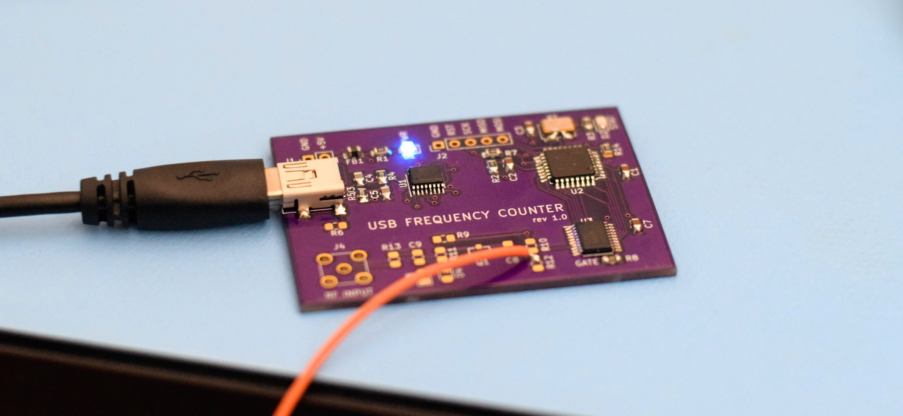
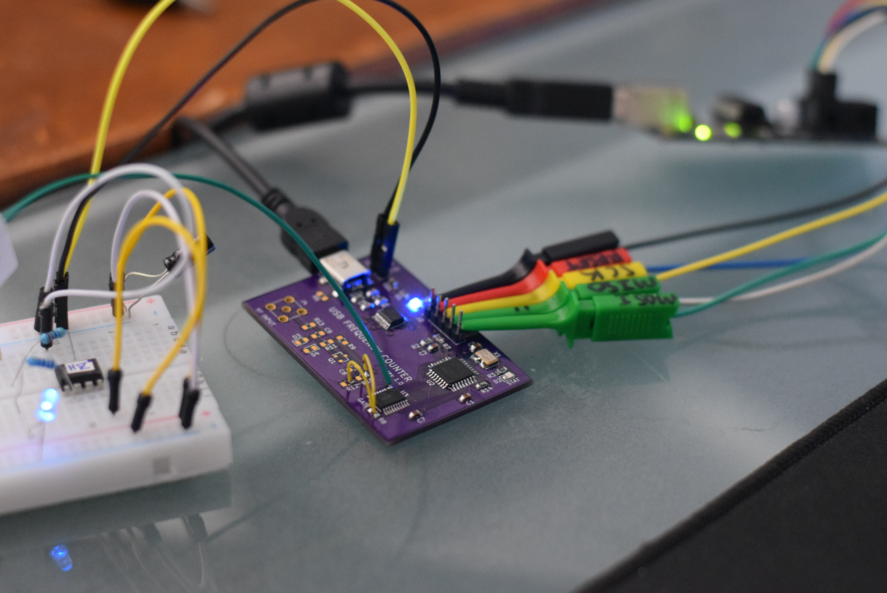
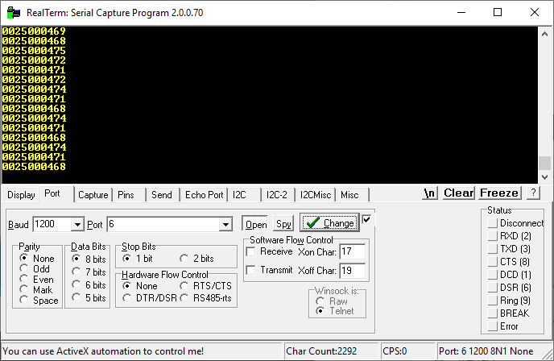

# USB Counter

This project folder contains the design, notes, and experiments relating to a USB frequency counter (which can be configured as a pulse counter). USB connectivity is ideal for data-logging applications where counts are to be monitored over time. 

Like other counter designs this one has an _input_ and a _gate_. Every time the gate goes high, the count is transmitted to the computer. Counts "roll over" from one gate cycle to the next so no cycle is ever lost. This allows high-precision measurements given long periods of recording time.

If you don't have a precision 1Hz gate available, you're still covered! This device has a 10MHz temperature-compensated crystal oscillator which can be divided-down (in software) and used as a 1Hz gate.

**Project status: Alpha** - this project is in active development, and designs are not yet ready for serious public assessment.

## Revision 1.0

Serial communication works great. The MAX230 does great and also supplies a clean 3.3V to the rest of the board.

The counter IC wiring isn't correct. I was able to fix it with bodge wires but a revision 2 board is required. I don't know how messed this up. Changes include:

* RF must go into pin 1/2
* Gate must go into pin 7
* Pin 11 must be tied to VCC (3.3V)

When wired properly it works great. A TCXO clocks the microcontroller. A software timer generates the gate signal. When measuring the frequency of its own clock I get exactly 10 million. In this example I stuck a 25MHz can oscillator in the breadboard. A new line is printed every second indicating frequency:

The front-end also needs improvements. Make it as similar to the LTSpice circuit as possible.