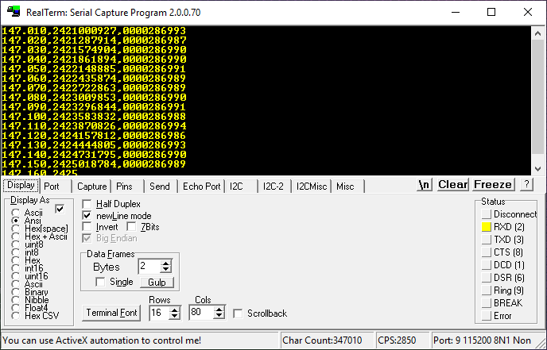
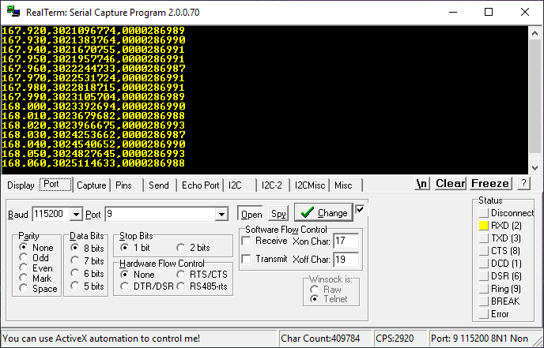
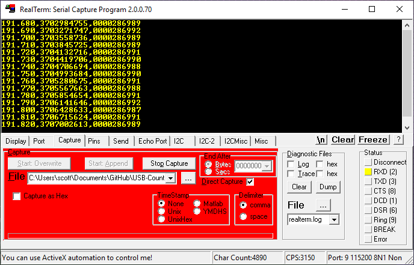

# Alternative Code

This folder contains code for an alternative use of this device: a pulse counter with 100Hz update rate.

### Sample Output

The file [sample-output.csv](sample-output.csv) contains a lot of data to practice analyzing. It also demonstrates one counter rollover.

The output is 3 columns: time (in seconds, rolls over at 100), counter value (rolls over at 2^32), and "new pulses" (number since the last count). A new line is written every 10 milliseconds (100Hz). I couldn't reliably make it run faster. The timing is very accurate, down to 2.5PPM, defined by the TCXO. In these screenshots and sample data it's measuring a can oscillator near 28.7 MHz.

```
031.630,3404678919,0000286989
031.640,3404965908,0000286989
031.650,3405252898,0000286990
031.660,3405539891,0000286993
031.670,3405826876,0000286985
031.680,3406113871,0000286995
031.690,3406400860,0000286989
031.700,3406687850,0000286990
031.710,3406974840,0000286990
031.720,3407261827,0000286987
031.730,3407548820,0000286993
031.740,3407835807,0000286987
```

### RealTerm Setup: Text


### RealTerm Setup: Port


### RealTerm Setup: CSV Output

