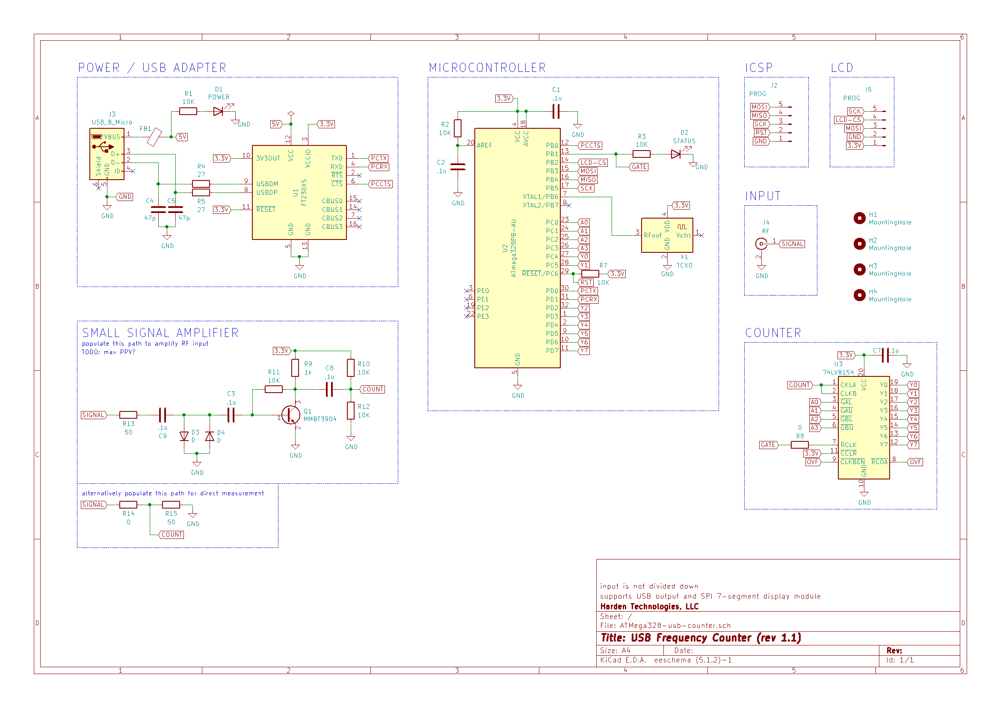

# USB Frequency Counter (rev 1.1)

### PCB Design

### Schematic

## Changes from 1.0
* improved RF amplifier design
* alternate path to bypass RF amplifier
* corrected counter pin connections
* free a MCU pin by making the status LED the gate
* add a header for the serial LED display
* run MCU at 14.7456 MHz
  * allows much faster serial transmission
  * no longer accepts external 10MHz reference
  * may still accept external gate
* added screw holes
* switched to micro USB (from mini USB)

## TODO: order
* order 0805 diodes
* order mmbt3904
* micro USB
* 14 MHz oscillators

## Components
* all passives are 0805 (~$1)
* [14.7456MHz TCXO](https://www.mouser.com/ProductDetail/Fox/FOX924B-147456?qs=sGAEpiMZZMt8oz%2FHeiymADfzZKRiEXclvcmWd5jLzoM%3D) 2.5 PPM, 14.7456MHz ($2.36)
* [SN74LV8154](https://www.mouser.com/ProductDetail/Texas-Instruments/SN74LV8154PWR?qs=sGAEpiMZZMtdY2G%252BSI3N4aQvQNXOTGN6Ghdjz%252BkScFE%3D) ($0.99) TSSOP-20
* [FT230XS-R](https://www.mouser.com/ProductDetail/FTDI/FT230XS-R?qs=sGAEpiMZZMtv%252Bwxsgy%2FhiIaF6qCroMVR1i2pEQA5UpU%3D) ($2.04) SSOP-16
* [ATMega328](https://www.mouser.com/ProductDetail/Microchip-Technology-Atmel/ATMEGA328PB-AU?qs=sGAEpiMZZMvc81WFyF5EdrSRAEYMYvHlMc95YQj%2FArE%3D) ($1.38)
* [mini-USB jack](https://www.mouser.com/ProductDetail/CUI/UJ2-MBH-1-SMT-TR?qs=sGAEpiMZZMu3xu3GWjvQiLfiCTO8RP%252Bk%252BIiwpoT5qew%3D) ($0.49)
* [micro-USB jack](https://www.mouser.com/ProductDetail/Hirose-Connector/ZX62D-B-5PA830?qs=sGAEpiMZZMulM8LPOQ%252Byk6r3VmhUEyMLT8hu1C1GYL85FtczwhvFwQ%3D%3D) ($0.70)
* [SMA connector](https://www.mouser.com/ProductDetail/LPRS/SMA-CONNECTOR?qs=sGAEpiMZZMuLQf%252BEuFsOrkd7M7rmHNHidLMZ%2Ftb%252B0T1YCJLScw0qLA%3D%3D) ($1.08)
* [SPI-driven 8-digit 7-segment display module](https://www.amazon.com/dp/B07CL2YNJQ) ($13 for 4)