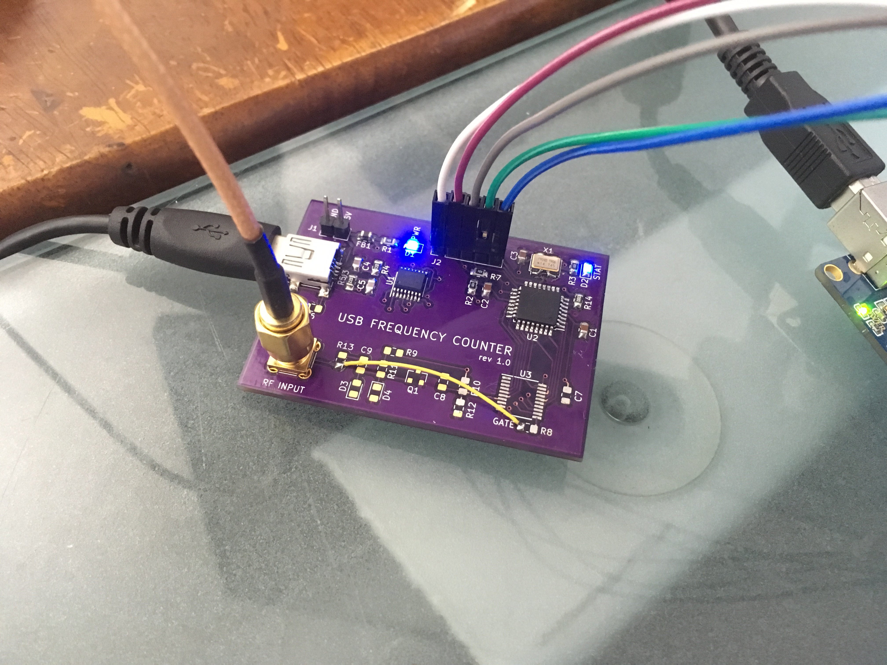

# Test Signal Generator

It is useful to simulate pulses to practice counting them. A rev 1.0 counter board was repurposed to _produce_ signals.

Output is 48.83 kHz of 136 ns pulses. 

The counter can count 50MHz RF (20 ns period) so I suspect it can count pulses of much shorter duratioin.

