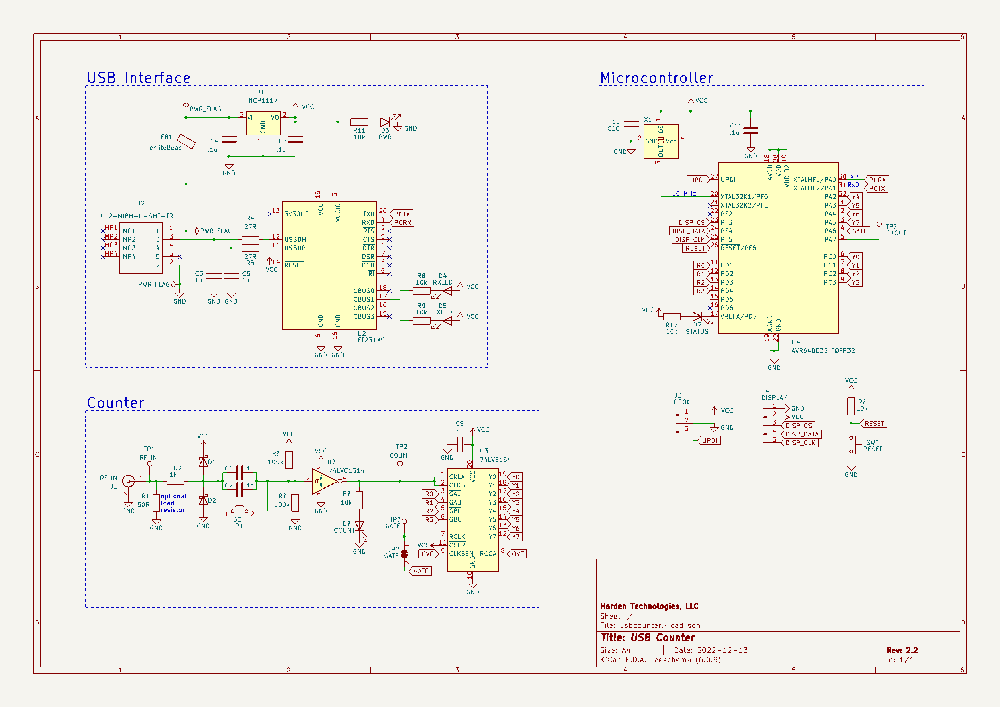
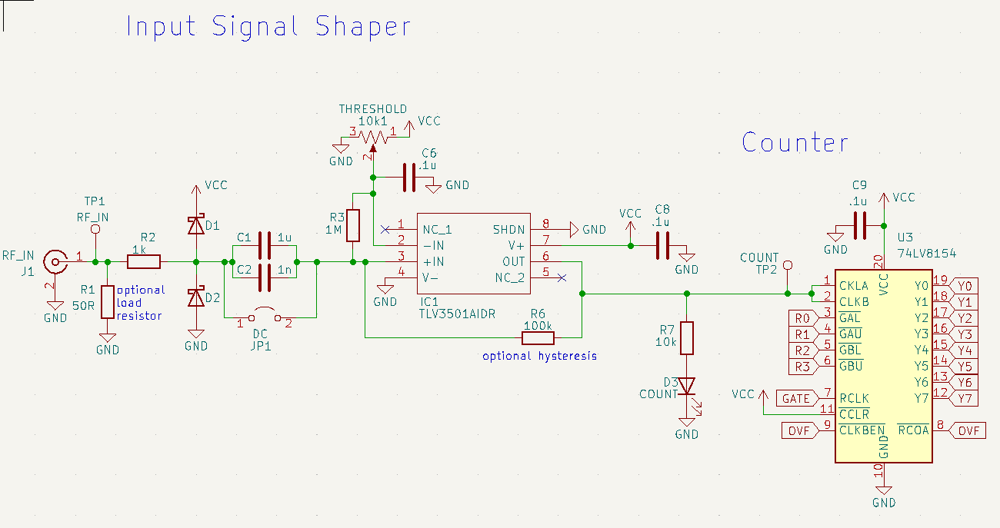
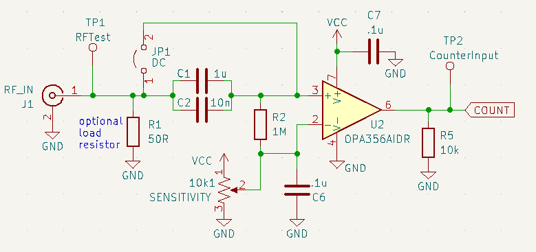

# Version 2.2

## Thoughts

* Make an RF amplifier board separately (perhaps with prescaler)
* Input should be 0-5V TTL
* What makes this unique is no-cycle-lost counting
* Ability to accept a 10 MHz lab reference clock is also a big win

## Build notes
* LED resistors should be 1K
* Capacitors on USB line should be 47pF
* LJCPCB blue silkscreen is ugly and doesn't hold up to heat as well as green

## Schematic

## Alternative Frontend Designs

### TLV3501 RF Comparator

### OPA356 RF Opamp

