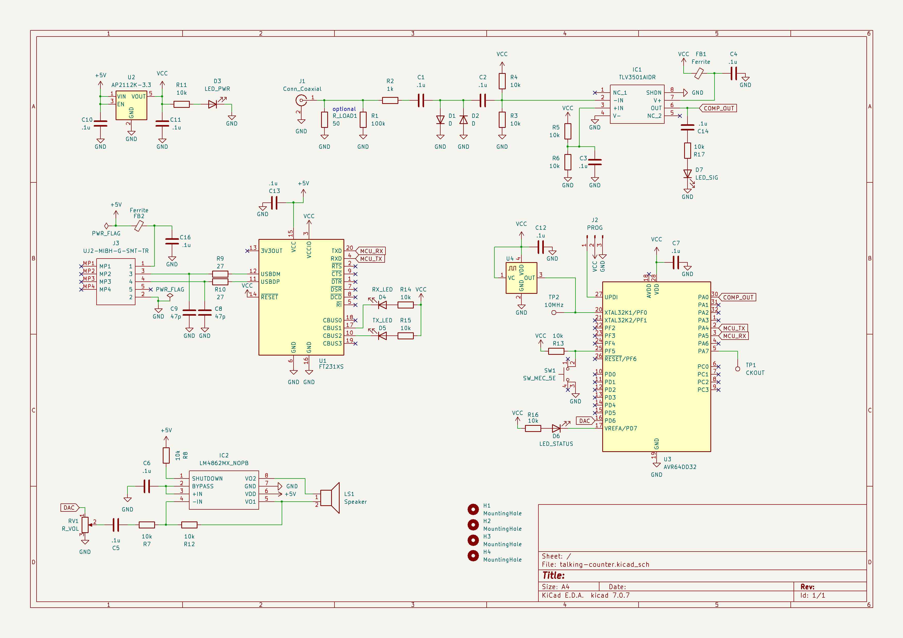

# Talking Frequency Counter

This folder contains design notes for a ***talking frequency counter*** designed to help visually impaired radio operators to know what frequency they are transmitting on by speaking the frequency out loud when a button is pressed. This design uses a high-speed analog comparator to amplify signals on the frontend, measures them directly with a microcontroller, sends that data to a PC using a USB serial adapter, and also says the frequency out loud using a speaker.

> **⚠️ WARNING:** THIS PROJECT IS A WORK IN PROGRESS

## Components
* **AP2112K-3.3TRG1** 600 mA 3.3V LDO regulator ([$0.35 from Mouser](https://www.mouser.com/ProductDetail/Diodes-Incorporated/AP2112K-3.3TRG1?qs=x6A8l6qLYDDPYHosCdzh%2FA%3D%3D))
* **AVR64DD32** 8-bit microcontroller ([$1.51 on Mouser](https://www.mouser.com/ProductDetail/Microchip-Technology/AVR64DD32-I-PT?qs=tlsG%2FOw5FFjuwvYsegdIqg%3D%3D))
* **Oscillator** 10 MHz oscillator, 3.3V, ±2.5 ppm ([$1.89 on Mouser](https://www.mouser.com/ProductDetail/ECS/ECS-TXO-2016-33-100-TR?qs=PzGy0jfpSMvd6OxkHIkpfg%3D%3D))
* **TLV3501** high speed analog comparator ([$3.06 on Mouser](https://www.mouser.com/ProductDetail/Texas-Instruments/TLV3501AIDR?qs=m96fseALk3U7ir0PfDMQ%252BA%3D%3D))
* **LM4862** audio amplifier ([$1.21 on Mouser](https://www.mouser.com/ProductDetail/Texas-Instruments/LM4862MX-NOPB?qs=QbsRYf82W3HZp12WHQE14A%3D%3D))
* **FT231** USB Serial Adapter ([$2.33 on Mouser](https://www.mouser.com/ProductDetail/FTDI/FT231XS-R?qs=Gp1Yz1mis3WduRPsgrTbtg%3D%3D))
* **Diode** 100V 4A 4ns recovery ([$0.13 on Mouser](https://www.mouser.com/ProductDetail/Panjit/1N4148W_R1_00001?qs=sPbYRqrBIVnqVztCqPNVrw%3D%3D))
* **Speaker** 8Ω 300 mW ([$2.09 on Mouser](https://www.mouser.com/ProductDetail/DB-Unlimited/SM231508-1?qs=t9M3m0YJX4Ng139DBuQXjw%3D%3D))
* **USB Connector** type B micro ([$0.50 on Mouser](https://www.mouser.com/ProductDetail/CUI-Devices/UJ2-MIBH-G-SMT-TR?qs=IS%252B4QmGtzzpvS1XQusp0iA%3D%3D))
* **0802 Components** are purchased in bulk and essentially free

_Approximately $13 total_

## Schematic

## Resources

* [100 MHz frequency counter](https://www.electronics-lab.com/project/100mhz-frequency-counter-with-pic16f628a-2/) (designed by Hristo) uses the TLV3501 for its frontend

* [Frequency Measurement with Modern AVR Microcontrollers](https://swharden.com/blog/2023-08-31-avr-dd-frequency-counter/)

* [Play Audio from SPI Flash with a Microcontroller](https://swharden.com/blog/2023-08-26-spi-flash-audio/)

* [Speaking Numbers with a Microcontroller](https://swharden.com/blog/2023-08-19-speaking-microcontroller/)