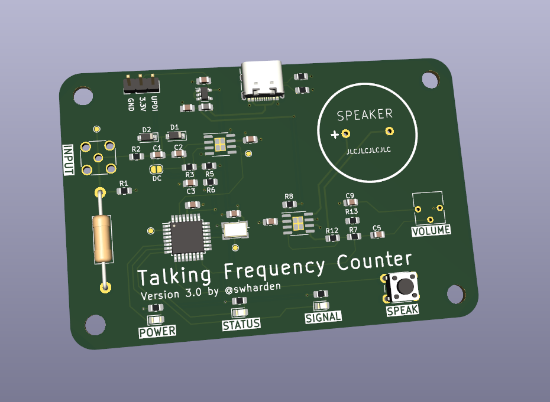
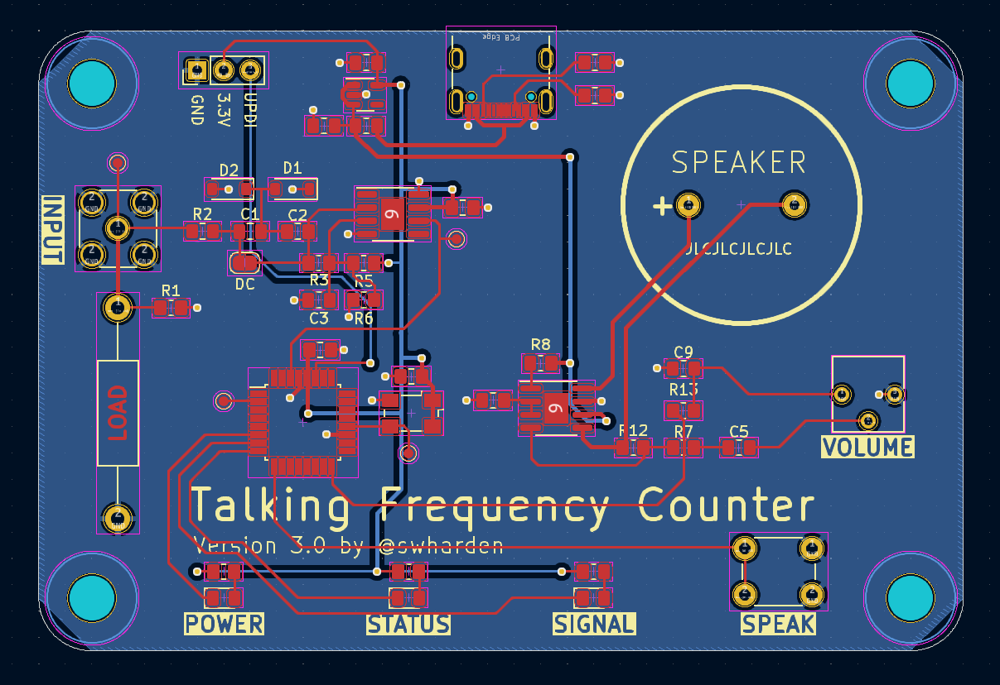
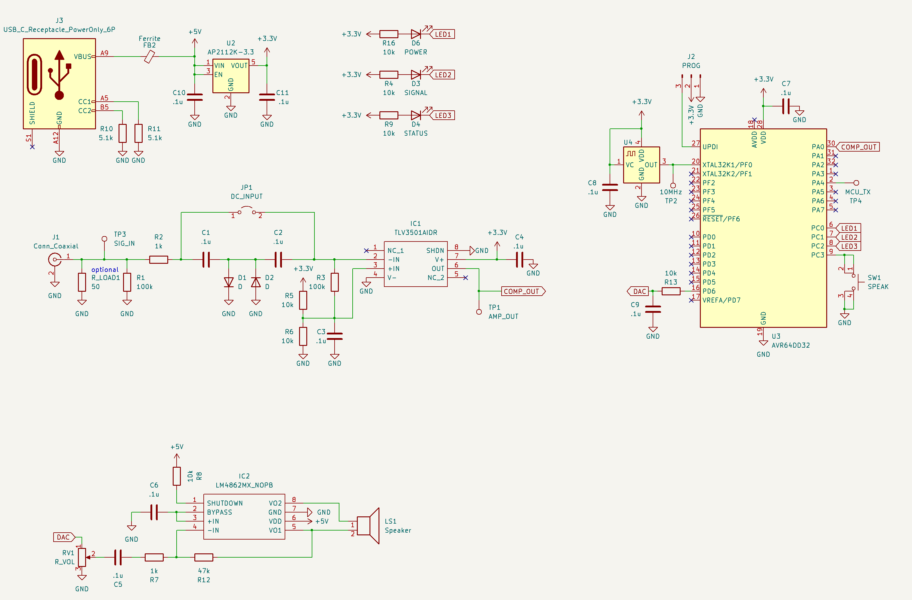

# Talking Frequency Counter

This version of the frequency counter uses USB for power (not connectivity) and speaks frequency out loud when a button is pressed. Once finished this project will probably be moved into its own repository.

## Build Notes

* VDDIO2 should be connected to 3.3V (required bodge wire)
* Crystal pads are silly big
* Audio amplifier shutdown should be pulled LOW not HIGH
* Volume knob is wired backwards
* Rename header 3.3v to VCC
* Button is wired incorrectly (always grounded)
* Move header closer to the edge or use different system
* Don't use port C for LEDs or button